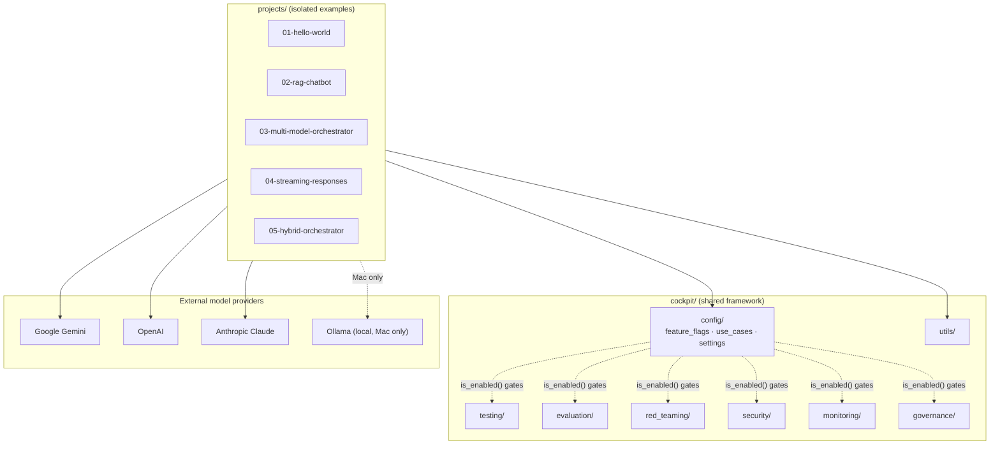

# Architecture

## Overview

AI Engineering Cockpit is split into two halves that intentionally don't share
code at import time:

1. **`cockpit/`** — a shared, feature-flagged framework: testing helpers,
   evaluation, red-teaming, security, monitoring, governance, config, and
   utils. This is the "engineering control center" — cross-cutting concerns
   any AI project in the repo can opt into.
2. **`projects/`** — small, isolated example applications (`01-hello-world`
   through `05-hybrid-orchestrator`). Each project has its own
   `pyproject.toml`, its own `.venv` (managed by `uv`), and its own tests.
   Projects are meant to be read top-to-bottom by a newcomer without needing
   to understand the rest of the repo first.

Keeping projects isolated (separate dependency locks) means a change to one
example's dependencies can never break another, and means each project's
`README.md` can be a self-sufficient tutorial.

## Layered design



## Feature-flag-driven modularity

Every framework under `cockpit/` (other than `config` and `utils`, which are
always active) is switched on or off through
`cockpit/config/feature_flags.py`:

```python
FRAMEWORKS_ENABLED: dict[str, bool] = {
    "testing": True,
    "evaluation": True,
    "red_teaming": True,
    "security": True,
    "monitoring": True,
    "governance": True,
}
```

All six are implemented and on by default. The flags exist so a deployment
can switch off what it does not want — a research setup with no compliance
obligations can drop governance, a cost-sensitive one can drop red-teaming —
not because anything here is unfinished. See
`cockpit/config/use_cases.py` for pre-built profiles (startup, enterprise,
research, safety-focused).

Code that touches an optional framework should call `is_enabled("<name>")`
first and no-op (rather than error) when it's disabled:

```python
from cockpit.config.feature_flags import is_enabled

if is_enabled("monitoring"):
    record_cost_metrics(...)
```

`cockpit/config/use_cases.py` layers pre-configured profiles
(`startup`, `enterprise`, `research`, `safety_focused`) on top of the raw
flags — each maps to a dict with the same shape as `FRAMEWORKS_ENABLED`, so a
deployment can pick a profile instead of hand-tuning every flag:

```python
from cockpit.config.use_cases import get_use_case_flags

flags = get_use_case_flags("startup")
# {"testing": True, "evaluation": False, "red_teaming": False,
#  "security": False, "monitoring": False, "governance": False}
```

`cockpit/config/settings.py` reads runtime configuration (API keys, the
active use case, log level) from the environment via `get_settings()`, so
nothing sensitive is hardcoded.

## Cross-platform split: Windows (cloud-only) vs Mac (hybrid)

The platform runs on both Windows and Mac, but the model-serving story
differs:

- **Windows**: cloud APIs only (Gemini, OpenAI, Anthropic). No local model
  runtime is assumed to be installed or supported.
- **Mac**: hybrid — the same cloud APIs, plus an optional local Ollama
  server (`OLLAMA_HOST`, default `http://localhost:11434`) for offline or
  cost-free experimentation. `projects/05-hybrid-orchestrator` demonstrates
  routing between local and cloud models.

See [WINDOWS_VS_MAC.md](WINDOWS_VS_MAC.md) for the full rationale and setup
differences.

## Data flow (typical request)

```
User input
   -> project's src/main.py
   -> cockpit/config (load settings + feature flags)
   -> cockpit/security (if enabled: input validation)
   -> model provider client (Gemini / OpenAI / Anthropic / Ollama)
   -> cockpit/evaluation (if enabled: score the response)
   -> cockpit/monitoring (if enabled: record cost/latency)
   -> response returned to user
```

Each `cockpit/` framework is designed to be inserted into this pipeline
independently — disabling one never breaks the others, and the pipeline
still runs end-to-end with every optional framework switched off.

Gating is applied at the top-level entry points only. Pure computation —
cost math, percentile calculation, hash-chain verification, permission
lookups — is never flag-gated, on the reasoning that a flag should not take
away the tools you need while investigating an incident.

## Testing surface

- `cockpit/*/` frameworks ship their own unit tests colocated with the
  framework (owned by that framework's implementer).
- Root-level `tests/` (this repo) exercises `cockpit/config/*` directly
  and does structural smoke checks on the rest of the repo — it
  deliberately does not reach into framework internals, so it stays stable
  while individual frameworks evolve.
- Each `projects/0*-*/tests/` suite tests that project only, inside its own
  isolated virtual environment.
