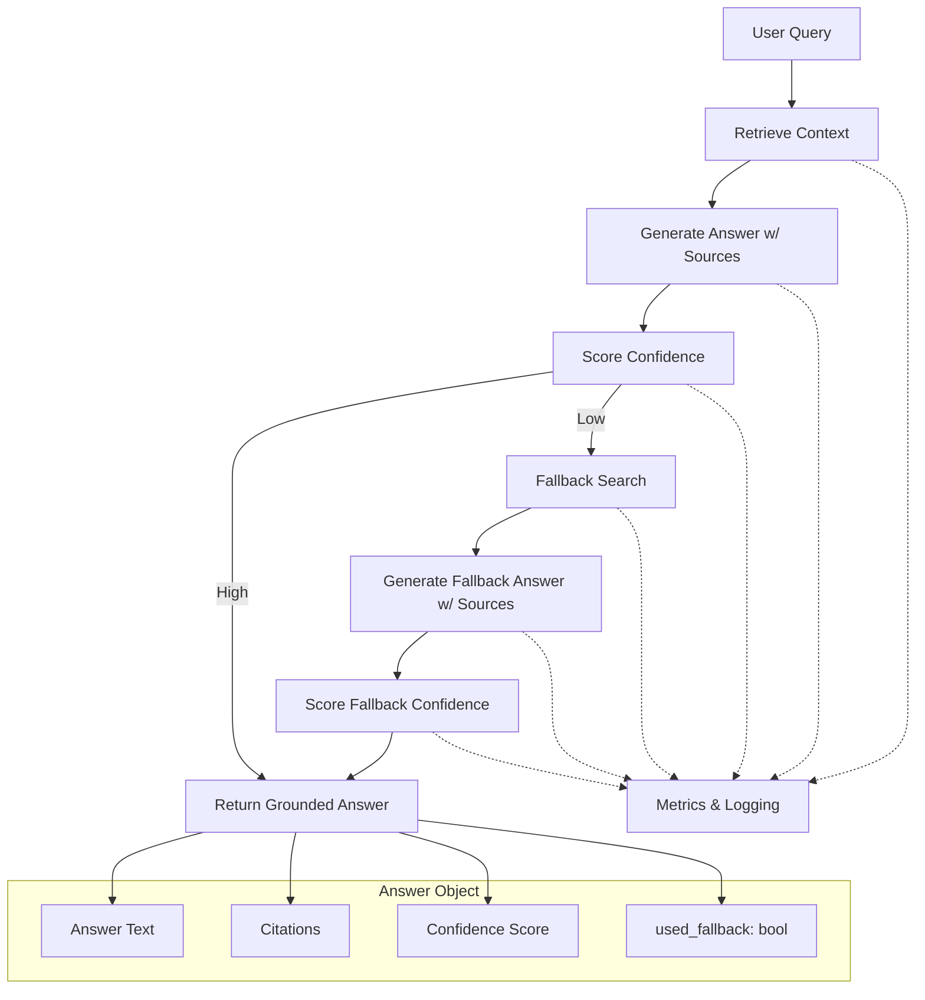

# RAG Agent with Citation Grounding — Full Specification

**Status:** Draft

## Overview

A Retrieval-Augmented Generation (RAG) agent designed to:

- Retrieve context
- Generate answers with citations
- Score confidence
- Trigger fallback search when needed
- Prevent hallucinations at scale

---

## 1. Mermaid Flowchart



---

## 2. Production Blueprint

### Core Components

- **RAGAgent** — orchestrates retrieval → generation → scoring → fallback
- **Retriever** — abstracts vector DB / hybrid search
- **LLM Interface** — enforces citation-rich generation
- **CitationGrounder** — resolves citation IDs → real sources
- **ConfidenceScorer** — determines if fallback is needed
- **FallbackSearch** — external search wrapper
- **MetricsLogger** — logs events + metrics

### Data Models

**Query**

- `id`
- `text`
- `timestamp`
- `metadata`

**ContextItem**

- `id`
- `source_uri`
- `title`
- `snippet`
- `score`

**Answer**

- `text`
- `citations[]`
- `confidence`
- `used_fallback`
- `raw_context_ids[]`

**Citation**

- `context_id`
- `source_uri`
- `title`
- `snippet`

### Control Flow

1. Receive query → log
2. Retrieve context
3. Generate answer with citations
4. Score confidence
5. If high → return
6. If low → fallback search
7. Generate fallback answer
8. Score again
9. Return final grounded answer

### Hallucination Prevention

- Strict prompting: answer only from context
- “I don’t know” allowed
- Mandatory citations
- Post-hoc validation
- Metrics: fallback rate, confidence distribution, hallucination flags

---

## Appendix: Implementation Prompt

The prompt used to generate a skeleton implementation of this design, kept
verbatim for reference.

```text
You are Claude Code. Generate a production-ready SKELETON implementation of a
**RAG Agent with Citation Grounding** in TWO languages:

1) Python (async, using asyncio)
2) TypeScript (Node.js, async/await)

Capabilities:
- retrieve_context(query)
- generate_answer_with_sources(context, query)
- score_confidence(answer)
- fallback_search(query)
- return final answer object:
    { text, citations, confidence, used_fallback }

Architecture:
- Retriever interface
- LLM interface
- CitationGrounder
- ConfidenceScorer
- SearchFallback
- RAGAgent orchestrator
- MetricsLogger

Requirements:
- Clean class-based design
- Clear method signatures
- Docstrings/JSDoc
- No external dependencies
- Use TODO comments for integrations

Output:
- First: Python code block
- Second: TypeScript code block
- No explanation, only code.
```
