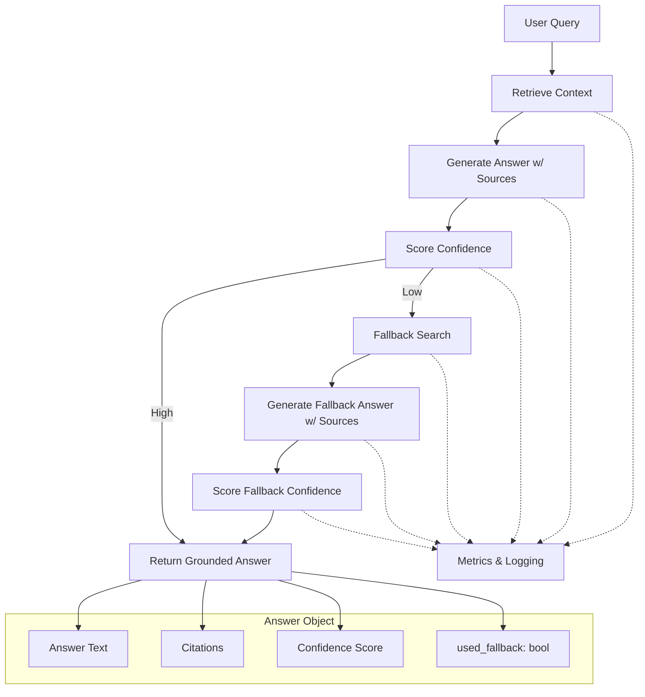

# RAG Agent with Citation Grounding — Full Specification

**Status:** Approved (decisions in section 3)

## Overview

A Retrieval-Augmented Generation (RAG) agent designed to:

- Retrieve context
- Generate answers with citations
- Score confidence
- Trigger fallback search when needed
- Prevent hallucinations at scale

---

## 1. Mermaid Flowchart



---

## 2. Production Blueprint

### Core Components

- **RAGAgent** — orchestrates retrieval → generation → scoring → fallback
- **Retriever** — abstracts vector DB / hybrid search
- **LLM Interface** — enforces citation-rich generation
- **CitationGrounder** — resolves citation IDs → real sources
- **ConfidenceScorer** — determines if fallback is needed
- **FallbackSearch** — external search wrapper
- **MetricsLogger** — logs events + metrics

### Data Models

**Query**

- `id`
- `text`
- `timestamp`
- `metadata`

**ContextItem**

- `id`
- `source_uri`
- `title`
- `snippet`
- `score`

**Answer**

- `text`
- `citations[]`
- `confidence`
- `used_fallback`
- `raw_context_ids[]`

**Citation**

- `context_id`
- `source_uri`
- `title`
- `snippet`

### Control Flow

1. Receive query → log
2. Retrieve context
3. Generate answer with citations
4. Score confidence
5. If high → return
6. If low → fallback search
7. Generate fallback answer
8. Score again
9. Return final grounded answer

### Hallucination Prevention

- Strict prompting: answer only from context
- “I don’t know” allowed
- Mandatory citations
- Post-hoc validation
- Metrics: fallback rate, confidence distribution, hallucination flags

---

## 3. Implementation Decisions

Settled 2026-09-17 before implementation. Implemented as
`projects/18-rag-citation-agent`, same shape as project 17: `src/agent.py`
and `src/agent.ts` component-for-component, stdlib only, integrations marked
`TODO(integration)`. Retriever, LLM and SearchFallback are abstract stubs;
everything else is real and tested.

### Citation markers

- The prompt lists context items numbered by position: `[1]`, `[2]`, ...
  Positional aliases keep the LLM away from copying opaque IDs (UUIDs, URIs).
- The LLM cites inline after each sentence: `Keys rotate every 90 days [2].`
  Groups `[1, 3]` and runs `[1][3]` are accepted.
- The grounder splits the answer into sentences (a run ending in `.`, `!` or
  `?`, plus any markers directly after it), resolves each marker against the
  context list, and **renumbers** markers by first appearance, so in the
  returned `Answer.text`, `[n]` always refers to `citations[n-1]`.
- A marker that resolves to nothing is an *unknown ref*: it is removed from
  the text, counted, and raises the `rag.hallucination_flag` metric.

### Confidence

```
coverage = sentences with >= 1 valid ref / all sentences
support  = mean retrieval score of the distinct cited items (clamped to [0, 1])
validity = valid refs / all refs
confidence = coverage × support × validity
```

- An answer that is exactly "I don't know" (case, apostrophe and trailing
  punctuation ignored) scores 0.
- An answer with no sentences or no refs scores 0.
- Threshold is a constructor argument, default `0.6`; `confidence >= threshold`
  is accepted.
- Retrievers and fallback search must return scores in `[0, 1]`.

### Fallback

1. Primary: retrieve → generate → ground → score. At or above threshold → return.
2. Otherwise fallback search. Context = primary context + search results,
   de-duplicated by `source_uri`, primary items first.
3. Generate → ground → score again. At or above threshold → return with
   `used_fallback = true`.
4. Otherwise **abstain**: text `I don't know.`, no citations, the fallback's
   actual confidence, `used_fallback = true`.

Empty context skips the LLM call and scores 0, so an empty primary goes
straight to fallback and an empty merged context abstains.

### Errors

- Retriever raises → logged, `rag.retrieve.error`, treated as empty context.
- Fallback search raises → logged, `rag.fallback.error`, abstain.
- LLM raises → propagates. A silent "I don't know" would hide an outage.

### Metrics

`MetricsLogger` keeps project 17's `increment` and `timing` and adds
`observe` for value distributions. Emitted: `rag.query`, `rag.fallback`,
`rag.abstain`, `rag.hallucination_flag`, `rag.retrieve.error`,
`rag.fallback.error`, `rag.confidence` (observe, tagged `stage=primary|fallback`),
and `rag.stage` timings tagged `stage=retrieve|generate|fallback_search`.

### Known ceilings

- Sentence splitting is punctuation-based: abbreviations ("e.g.") and decimals
  split early, which can lower coverage. Upgrade to a real segmenter if
  coverage looks noisy.
- A bare bracketed number in prose (`[2023]`) reads as a citation and counts
  as an unknown ref.
- Coverage and validity are structural checks, not entailment: a sentence can
  cite a real source that does not support it. An NLI or LLM-judge scorer
  plugs in behind `ConfidenceScorer`.

---

## Appendix: Implementation Prompt

The prompt used to generate a skeleton implementation of this design, kept
verbatim for reference.

```text
You are Claude Code. Generate a production-ready SKELETON implementation of a
**RAG Agent with Citation Grounding** in TWO languages:

1) Python (async, using asyncio)
2) TypeScript (Node.js, async/await)

Capabilities:
- retrieve_context(query)
- generate_answer_with_sources(context, query)
- score_confidence(answer)
- fallback_search(query)
- return final answer object:
    { text, citations, confidence, used_fallback }

Architecture:
- Retriever interface
- LLM interface
- CitationGrounder
- ConfidenceScorer
- SearchFallback
- RAGAgent orchestrator
- MetricsLogger

Requirements:
- Clean class-based design
- Clear method signatures
- Docstrings/JSDoc
- No external dependencies
- Use TODO comments for integrations

Output:
- First: Python code block
- Second: TypeScript code block
- No explanation, only code.
```
